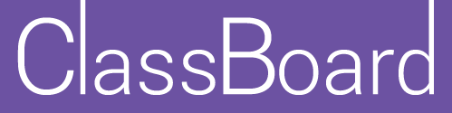

# Project Overview

ClassBoard is a configurable dashboard for classroom-related widgets. Our goal is to integrate as many classroom interactions as possible into the browser, allowing for a more streamlined and efficient classroom experience. Classrooms will become paperless when using ClassBoard, as it will keep all class documents stored in one place and organized. Other class activities such as splitting the class into groups or giving a timed quiz will also be performed by Classboard. There will be many widgets performing different functionalities, we will only highlight a few in this overview.

An attendance widget will perform the task of taking attendance, allowing the professor to no longer be concerned about which students will be marked present, as it will be done automatically when each student logs on to their room’s ClassBoard. Handouts will be easier than ever with simple drag and drop file sharing widgets. Students can utilize a widget to post questions to the dashboard that others can view and upvote or comment on. This will allow the professor to focus on answering the questions that the greatest number of students would like answered.


# Original Proposal

As the use of computers becomes increasingly ubiquitous, computers and mobile devices are becoming an integral component of many parts of daily life. While computer use is rare and sometimes even discouraged in the classroom, it is only a matter of time before teachers and administrators realize the true potential of using computers as a supplement to the class.

#Team Members

###Carter Tiernan
######Front-End Developer

###Matt McNally
######Full-Stack Developer

###Austin Sheppard
######Jack of All Trades

### Andrew Gora
######Back-End Developer

### Michael Lankenau
######Front-End Developer

#How to Run

```
$ npm install
$ npm start
```
Then go to localhost:3000 in browser.

To stop, hit control + c, then

```
$ npm stop
```
